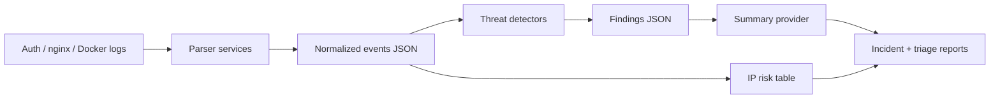
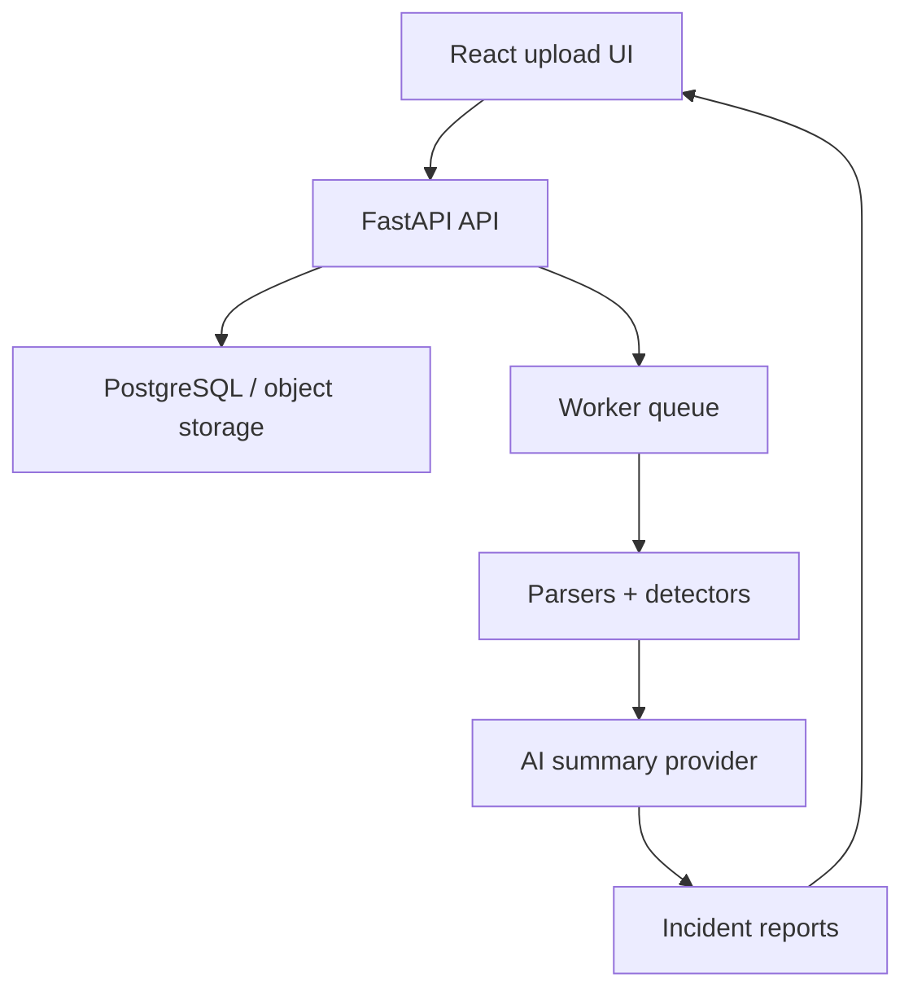

# ThreatLens AI Architecture

ThreatLens AI is currently a dependency-free CLI MVP for safe log investigation. It normalizes auth, nginx, and Docker logs, runs deterministic detectors, and produces analyst-friendly reports.

## Current MVP Flow

## Service Boundaries

- `log_parser.py` normalizes log lines into event dictionaries.
- `threat_detector.py` detects brute force, suspicious HTTP, credential exposure, and multi-signal IPs.
- `ai_summary.py` defines the summary provider boundary. The MVP uses a deterministic offline provider.
- `report_generator.py` produces incident, triage, and IP risk views.
- `cli.py` ties the local demo workflow together.

## Future Product Direction

Keep the detector and report layers provider-neutral so OpenAI, Claude, or an offline deterministic provider can be swapped without changing parsing logic.
